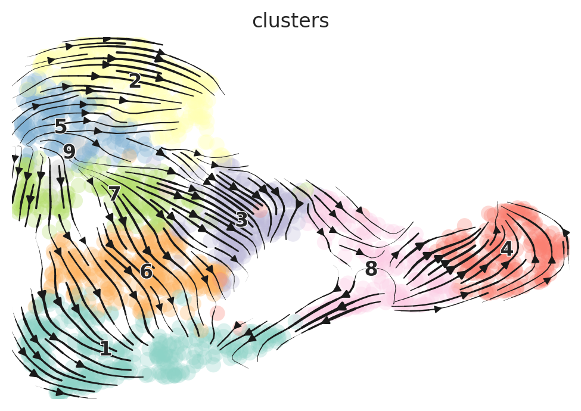

```python
import scvelo as scv
import cellrank as cr
import scanpy as sc
import pandas as pd
import pickle
scv.settings.verbosity = 3  # show errors(0), warnings(1), info(2), hints(3)
scv.settings.set_figure_params('scvelo')  # for beautified visualization
palette=["#8DD3C7","#FFFFB3","#BEBADA","#FB8072","#80B1D3","#FDB462","#B3DE69","#FCCDE5","#D9D9D9"]
```


```python
clusters=pd.read_csv("_Velo/clusters_all.csv",index_col=0)
```


```python
adata=scv.read("_Velo/100pka.loom",cache=True)
adata.obs.index=(map(lambda y: "hard_"+y.split("x")[0]+"-1",map(lambda x: x.split(":")[1],adata.obs.index)))
umap=pd.read_csv("_Velo/UMAP_100pka.csv",index_col=0)
adata=adata[umap.index,:]
adata.obsm["X_umap"]=umap.values
adata_hard=adata
adata.obs['clusters']=clusters["x"].values[clusters.index.str.contains("hard")]
adata.var_names_make_unique()
scv.tl.score_genes_cell_cycle(adata)
scv.pp.filter_and_normalize(adata, min_shared_counts=20, n_top_genes=2000)
scv.pp.moments(adata, n_pcs=30, n_neighbors=30)
scv.tl.velocity(adata)
scv.tl.velocity_graph(adata)
scv.pl.velocity_embedding_stream(adata, basis='umap')
umap2=pd.read_csv("_Velo/UMAP_100pka_2.csv",index_col=0)
umap2.index=(map(lambda x: x.split("_")[1],umap2.index))
adata.obsm["X_umap2"]=umap2.values
scv.pl.velocity_embedding_stream(adata, basis='umap2')
```

    Variable names are not unique. To make them unique, call `.var_names_make_unique`.
    Variable names are not unique. To make them unique, call `.var_names_make_unique`.
    Variable names are not unique. To make them unique, call `.var_names_make_unique`.


    calculating cell cycle phase
    -->     'S_score' and 'G2M_score', scores of cell cycle phases (adata.obs)
    Filtered out 46300 genes that are detected 20 counts (shared).
    Normalized count data: X, spliced, unspliced.
    Logarithmized X.
    computing neighbors
        finished (0:00:03) --> added 
        'distances' and 'connectivities', weighted adjacency matrices (adata.obsp)
    computing moments based on connectivities
        finished (0:00:00) --> added 
        'Ms' and 'Mu', moments of spliced/unspliced abundances (adata.layers)
    computing velocities
        finished (0:00:00) --> added 
        'velocity', velocity vectors for each individual cell (adata.layers)
    computing velocity graph
        finished (0:00:05) --> added 
        'velocity_graph', sparse matrix with cosine correlations (adata.uns)
    computing velocity embedding
        finished (0:00:00) --> added
        'velocity_umap', embedded velocity vectors (adata.obsm)


    computing velocity embedding
        finished (0:00:00) --> added
        'velocity_umap2', embedded velocity vectors (adata.obsm)


```python
scv.pl.scatter(adata,basis="umap2", color_gradients=['S_score', 'G2M_score'], smooth=True, perc=[5, 95],fontsize=18, size=200,figsize=[8,8],dpi=600,save="hard_umap_cc.png")
```

    saving figure to file ./figures/scvelo_hard_umap_cc.png


```python
scv.tl.recover_dynamics(adata)
scv.tl.velocity(adata, mode='dynamical')
scv.tl.velocity_graph(adata)
```

    recovering dynamics
        finished (0:09:07) --> added 
        'fit_pars', fitted parameters for splicing dynamics (adata.var)
    computing velocities
        finished (0:00:07) --> added 
        'velocity', velocity vectors for each individual cell (adata.layers)
    computing velocity graph
        finished (0:00:02) --> added 
        'velocity_graph', sparse matrix with cosine correlations (adata.uns)


```python
scv.pl.velocity_embedding_stream(adata, basis='umap2',title="",linewidth=2,alpha=.6,density=.8,
                                 figsize=[5,5],dpi=600,palette=palette,legend_loc="none",save="hard_umap_stream.png")
```

    saving figure to file ./figures/scvelo_hard_umap_stream.png


```python
scv.tl.recover_latent_time(adata)

scv.pl.scatter(adata, basis='umap2',color='latent_time', fontsize=18, size=200,figsize=[8,8],dpi=600,
               color_map='gnuplot', perc=[2, 98], colorbar=True, rescale_color=[0,1],save="hard_umap_latent_dyn.png")
```

    saving figure to file ./figures/scvelo_hard_umap_latent_dyn.png


```python
import seaborn as sns
sns.kdeplot(adata.var["fit_likelihood"])
```


    <matplotlib.axes._subplots.AxesSubplot at 0x7f86640de9b0>


```python
adata=adata[:,adata.var["fit_likelihood"]>.4]
scv.pp.moments(adata, n_pcs=30, n_neighbors=30)
scv.tl.velocity(adata, mode='dynamical')
scv.tl.velocity_graph(adata)
scv.tl.velocity_embedding(adata, basis='umap2')
scv.pl.velocity_embedding_stream(adata, basis='umap2')

```

    computing moments based on connectivities
        finished (0:00:00) --> added 
        'Ms' and 'Mu', moments of spliced/unspliced abundances (adata.layers)
    computing velocities
        finished (0:00:00) --> added 
        'velocity', velocity vectors for each individual cell (adata.layers)
    computing velocity graph
        finished (0:00:01) --> added 
        'velocity_graph', sparse matrix with cosine correlations (adata.uns)
    computing velocity embedding
        finished (0:00:00) --> added
        'velocity_umap2', embedded velocity vectors (adata.obsm)


```python
adata
```


    AnnData object with n_obs × n_vars = 2006 × 166
        obs: 'clusters', 'initial_size_unspliced', 'initial_size_spliced', 'initial_size', 'n_counts', 'velocity_self_transition', 'root_cells', 'end_points', 'velocity_pseudotime', 'latent_time', 'S_score', 'G2M_score', 'clusters_gradients'
        var: 'Accession', 'Chromosome', 'End', 'Start', 'Strand', 'gene_count_corr', 'means', 'dispersions', 'dispersions_norm', 'velocity_gamma', 'velocity_r2', 'velocity_genes', 'fit_alpha', 'fit_beta', 'fit_gamma', 'fit_t_', 'fit_scaling', 'fit_std_u', 'fit_std_s', 'fit_likelihood', 'fit_u0', 'fit_s0', 'fit_pval_steady', 'fit_steady_u', 'fit_steady_s', 'fit_variance', 'fit_alignment_scaling', 'fit_r2'
        uns: 'clusters_colors', 'clusters_sizes', 'neighbors', 'paga', 'pca', 'recover_dynamics', 'velocity_graph', 'velocity_graph_neg', 'velocity_params'
        obsm: 'X_diff', 'X_pca', 'X_umap', 'X_umap2', 'velocity_diff', 'velocity_umap', 'velocity_umap2'
        varm: 'PCs', 'loss'
        layers: 'Ms', 'Mu', 'ambiguous', 'fit_t', 'fit_tau', 'fit_tau_', 'matrix', 'spliced', 'unspliced', 'variance_velocity', 'velocity', 'velocity_u'
        obsp: 'connectivities', 'distances'


```python
scv.settings.set_figure_params('scvelo')
adata.obs["mesenchyme_bridge"]=adata.obs["clusters"].isin(["8","1"])
scv.tl.rank_velocity_genes(adata, groupby="mesenchyme_bridge",n_genes=18)
mesenchyme_bridge=pd.DataFrame(adata.uns['rank_velocity_genes']['names'])
adata.obs["cycling_bridge"]=adata.obs["clusters"].isin(["8","3"])
scv.tl.rank_velocity_genes(adata, groupby="cycling_bridge",n_genes=18)
cycling_bridge=pd.DataFrame(adata.uns['rank_velocity_genes']['names'])
scv.pl.scatter(adata, basis=cycling_bridge["True"].values.tolist(), fontsize=16, size=100, linewidth=3,color="clusters",
               frameon=False, figsize=[5,5],legend_loc='none',dpi=150,ncols=3,groups=["3","8","4"],add_outline='3, 8,4',save="hard_8_3_bridge.png")

scv.pl.scatter(adata, basis=mesenchyme_bridge["True"].values.tolist(), fontsize=16, size=100, linewidth=3,color="clusters",
               frameon=False, figsize=[5,5],legend_loc='none',dpi=150,ncols=3,groups=["1","8","4"],add_outline='1, 8,4',save="hard_8_1_bridge.png")
```

    ranking velocity genes
        finished (0:00:00) --> added 
        'rank_velocity_genes', sorted scores by group ids (adata.uns) 
        'spearmans_score', spearmans correlation scores (adata.var)
    ranking velocity genes
        finished (0:00:00) --> added 
        'rank_velocity_genes', sorted scores by group ids (adata.uns) 
        'spearmans_score', spearmans correlation scores (adata.var)
    saving figure to file ./figures/scvelo_hard_8_3_bridge.png


    saving figure to file ./figures/scvelo_hard_8_1_bridge.png


```python
scv.pl.scatter(adata, basis=["Myl1","Srl","Mymk","Ryr1"], fontsize=20, size=100, linewidth=3,color="clusters",
               frameon=False, figsize=[5,5],legend_loc='none',dpi=150,ncols=2,groups=["3","8","4"],add_outline='3, 8,4',save="hard_8_3_bridge_markers.png")
```

    saving figure to file ./figures/scvelo_hard_8_3_bridge_markers.png


```python
adata.write_h5ad("adata_hard.h5ad")
```


```python
adata=scv.read("adata_hard.h5ad")
```


```python
aspects=pd.read_csv("_Output/aspects_2_3.csv",index_col=0)
adata.obs["aspect"]=aspects.loc[adata.obs_names,"aspect3"]
adata.obs["CytoTRACE"]=pd.read_table("figures/100pkaCytoTRACE_plot_table.txt")["CytoTRACE"]
from matplotlib.colors import LinearSegmentedColormap
cm=LinearSegmentedColormap.from_list("cm",["darkgreen","lightgrey","darkorange"])
import numpy as np
v=np.min([adata.obs.aspect.abs().max(),-adata.obs.aspect.min()])
adata.obsm["X_umap"]=adata.obsm["X_umap2"]
sc.set_figure_params(figsize=(6,6),dpi_save=600,frameon=False)
sc.pl.umap(adata,color="aspect",size=200,color_map=cm,vmin=-v,vmax=v,save="_hard_cc_aspect.png",title="")
sc.pl.umap(adata,color='latent_time', size=200,vmin="p2",vmax="p98", color_map='gnuplot',save="_hard_latent_time.png",title="")
sc.pl.umap(adata,color='CytoTRACE', size=200,color_map='Spectral_r',save="_hard_CytoTRACE.png",title="")
```

    WARNING: saving figure to file figures/umap_hard_cc_aspect.png


    WARNING: saving figure to file figures/umap_hard_latent_time.png


    WARNING: saving figure to file figures/umap_hard_CytoTRACE.png


```python
adata=scv.read("_Velo/05pka.loom",cache=True)
adata.obs.index=(map(lambda y: "soft_"+y.split("x")[0]+"-1",map(lambda x: x.split(":")[1],adata.obs.index)))
umap=pd.read_csv("_Velo/UMAP_05pka.csv",index_col=0)
adata=adata[umap.index,:]
adata.obsm["X_umap"]=umap.values
adata_soft=adata
#clusters=pd.read_csv("_Velo/clusters_05pka.csv",index_col=0)
adata.obs['clusters']=clusters["x"].values[clusters.index.str.contains("soft")]
adata.var_names_make_unique()
scv.tl.score_genes_cell_cycle(adata)
scv.pp.filter_and_normalize(adata, min_shared_counts=20, n_top_genes=2000)
scv.pp.moments(adata, n_pcs=30, n_neighbors=30)
scv.tl.velocity(adata)
scv.tl.velocity_graph(adata)
scv.pl.velocity_embedding_stream(adata, basis='umap')
umap2=pd.read_csv("_Velo/UMAP_05pka_2.csv",index_col=0)
umap2.index=(map(lambda x: x.split("_")[1],umap2.index))
adata.obsm["X_umap2"]=umap2.values
scv.pl.velocity_embedding_stream(adata, basis='umap2')
diff=pd.read_csv("_Velo/UMAP_soft.csv",index_col=0)
diff.index=(map(lambda x: x.split("_")[1],diff.index))
adata.obsm["X_diff"]=diff.values
```

    Variable names are not unique. To make them unique, call `.var_names_make_unique`.
    Variable names are not unique. To make them unique, call `.var_names_make_unique`.
    Variable names are not unique. To make them unique, call `.var_names_make_unique`.


    calculating cell cycle phase
    -->     'S_score' and 'G2M_score', scores of cell cycle phases (adata.obs)
    Filtered out 46441 genes that are detected 20 counts (shared).
    Normalized count data: X, spliced, unspliced.
    Logarithmized X.
    computing neighbors
        finished (0:00:00) --> added 
        'distances' and 'connectivities', weighted adjacency matrices (adata.obsp)
    computing moments based on connectivities
        finished (0:00:00) --> added 
        'Ms' and 'Mu', moments of spliced/unspliced abundances (adata.layers)
    computing velocities
        finished (0:00:00) --> added 
        'velocity', velocity vectors for each individual cell (adata.layers)
    computing velocity graph
        finished (0:00:04) --> added 
        'velocity_graph', sparse matrix with cosine correlations (adata.uns)
    computing velocity embedding
        finished (0:00:00) --> added
        'velocity_umap', embedded velocity vectors (adata.obsm)


    computing velocity embedding
        finished (0:00:00) --> added
        'velocity_umap2', embedded velocity vectors (adata.obsm)


```python
scv.tl.recover_dynamics(adata)
scv.tl.velocity(adata, mode='dynamical')
scv.tl.velocity_graph(adata)
```

    recovering dynamics
        finished (0:08:18) --> added 
        'fit_pars', fitted parameters for splicing dynamics (adata.var)
    computing velocities
        finished (0:00:01) --> added 
        'velocity', velocity vectors for each individual cell (adata.layers)
    computing velocity graph
        finished (0:00:02) --> added 
        'velocity_graph', sparse matrix with cosine correlations (adata.uns)
    computing velocity embedding
        finished (0:00:00) --> added
        'velocity_umap2', embedded velocity vectors (adata.obsm)
    saving figure to file ./figures/scvelo_soft_umap_dyn.png


```python
scv.pl.velocity_embedding_stream(adata, basis='umap2',title="",linewidth=2,alpha=.6,density=.8,
                                 figsize=[5,5],dpi=600,palette=palette,legend_loc="none",save="soft_umap_stream_dyn.png")
```

    saving figure to file ./figures/scvelo_soft_umap_stream_dyn.png


```python
scv.tl.terminal_states(adata)
scv.tl.recover_latent_time(adata)
scv.pl.scatter(adata, basis='umap2',color='latent_time', fontsize=18, size=200,figsize=[8,8],dpi=600,
               color_map='gnuplot', perc=[2, 98], colorbar=True, rescale_color=[0,1],save="soft_umap_latent_dyn.png")
```

    computing terminal states
        identified 1 region of root cells and 1 region of end points 
        finished (0:00:02) --> added
        'root_cells', root cells of Markov diffusion process (adata.obs)
        'end_points', end points of Markov diffusion process (adata.obs)
    computing latent time using root_cells as prior
        finished (0:00:00) --> added 
        'latent_time', shared time (adata.obs)
    saving figure to file ./figures/scvelo_soft_umap_latent_dyn.png


```python
adata.var.loc["Neb"]["fit_likelihood"]
```


    0.6396588264806711


```python
import seaborn as sns
sns.kdeplotplot(adata.var["fit_likelihood"])
```


    <matplotlib.axes._subplots.AxesSubplot at 0x7f866bbafa90>


```python
adata=adata[:,adata.var["fit_likelihood"]>.4]
scv.pp.moments(adata, n_pcs=30, n_neighbors=30)
scv.tl.velocity(adata, mode='dynamical')
scv.tl.velocity_graph(adata)
scv.tl.velocity_embedding(adata, basis='umap2')
scv.pl.velocity_embedding_stream(adata, basis='umap2')

```

    computing moments based on connectivities
        finished (0:00:00) --> added 
        'Ms' and 'Mu', moments of spliced/unspliced abundances (adata.layers)
    computing velocities
        finished (0:00:00) --> added 
        'velocity', velocity vectors for each individual cell (adata.layers)
    computing velocity graph
        finished (0:00:00) --> added 
        'velocity_graph', sparse matrix with cosine correlations (adata.uns)
    computing velocity embedding
        finished (0:00:00) --> added
        'velocity_umap2', embedded velocity vectors (adata.obsm)





```python
scv.settings.set_figure_params('scvelo')
adata.obs["mesenchyme_bridge"]=adata.obs["clusters"].isin(["8","1"])
scv.tl.rank_velocity_genes(adata, groupby="mesenchyme_bridge",n_genes=18)
mesenchyme_bridge=pd.DataFrame(adata.uns['rank_velocity_genes']['names'])
adata.obs["cycling_bridge"]=adata.obs["clusters"].isin(["8","3"])
scv.tl.rank_velocity_genes(adata, groupby="cycling_bridge",n_genes=18)
cycling_bridge=pd.DataFrame(adata.uns['rank_velocity_genes']['names'])
scv.pl.scatter(adata, basis=cycling_bridge["True"].values.tolist(), fontsize=16, size=100, linewidth=3,color="clusters",
               frameon=False, figsize=[5,5],legend_loc='none',dpi=150,ncols=3,groups=["3","8","4"],add_outline='3, 8, 4',save="soft_8_3_bridge.png")

scv.pl.scatter(adata, basis=mesenchyme_bridge["True"].values.tolist(), fontsize=16, size=100, linewidth=3,color="clusters",
               frameon=False, figsize=[5,5],legend_loc='none',dpi=150,ncols=3,groups=["1","8","4"],add_outline='1, 8, 4',save="soft_8_1_bridge.png")
```

    ranking velocity genes
        finished (0:00:00) --> added 
        'rank_velocity_genes', sorted scores by group ids (adata.uns) 
        'spearmans_score', spearmans correlation scores (adata.var)
    ranking velocity genes
        finished (0:00:00) --> added 
        'rank_velocity_genes', sorted scores by group ids (adata.uns) 
        'spearmans_score', spearmans correlation scores (adata.var)
    saving figure to file ./figures/scvelo_soft_8_3_bridge.png


    saving figure to file ./figures/scvelo_soft_8_1_bridge.png


```python
scv.pl.scatter(adata, basis=["Myl1","Srl","Mymk","Ryr1"], fontsize=20, size=100, linewidth=3,color="clusters",
               frameon=False, figsize=[5,5],legend_loc='none',dpi=150,ncols=2,groups=["3","8","4"],add_outline='3, 8,4',save="soft_8_3_bridge_markers.png")
```

    saving figure to file ./figures/scvelo_soft_8_3_bridge_markers.png


```python
scv.tl.velocity_confidence(adata)
keys = 'velocity_length', 'velocity_confidence'
scv.pl.scatter(adata,basis="umap2", c=keys, cmap='coolwarm', perc=[5, 95])
```

    --> added 'velocity_length' (adata.obs)
    --> added 'velocity_confidence' (adata.obs)
    --> added 'velocity_confidence_transition' (adata.obs)


```python
adata.write_h5ad("adata_soft.h5ad")
```


```python
adata=scv.read("adata_soft.h5ad")
```


```python
aspects=pd.read_csv("_Output/aspects_2_3.csv",index_col=0)
adata.obs["aspect"]=aspects.loc[adata.obs_names,"aspect3"]
adata.obs["CytoTRACE"]=pd.read_table("figures/05pkaCytoTRACE_plot_table.txt")["CytoTRACE"]
from matplotlib.colors import LinearSegmentedColormap
cm=LinearSegmentedColormap.from_list("cm",["darkgreen","lightgrey","darkorange"])
import numpy as np
v=np.min([adata.obs.aspect.abs().max(),-adata.obs.aspect.min()])
adata.obsm["X_umap"]=adata.obsm["X_umap2"]
sc.set_figure_params(figsize=(6,6),dpi_save=600,frameon=False)
sc.pl.umap(adata,color="aspect",size=200,color_map=cm,vmin=-v,vmax=v,save="_soft_cc_aspect.png",title="")
sc.pl.umap(adata,color='latent_time', size=200,vmin="p2",vmax="p98", color_map='gnuplot',save="_soft_latent_time.png",title="")
sc.pl.umap(adata,color='CytoTRACE', size=200,color_map='Spectral_r',save="_soft_CytoTRACE.png",title="")
```

    WARNING: saving figure to file figures/umap_soft_cc_aspect.png


    WARNING: saving figure to file figures/umap_soft_latent_time.png


    WARNING: saving figure to file figures/umap_soft_CytoTRACE.png


